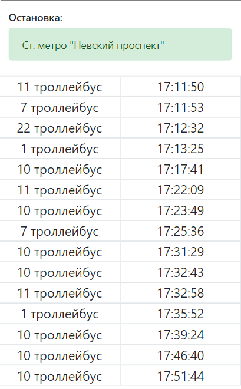

# real-time-transit
### Веб-приложение на Node.js, показывающее время прибытия общественного транспорта к остановке.
**Посмотреть можно тут: https://sanicdogg.github.io/real-time-transit**   
***

***
### Информация отображается в реальном времени.

Использует портал общественного транспорта Санкт-Петербурга:   
http://transport.orgp.spb.ru/Portal/transport/internalapi/gtfs   
Также использует GTFS Realtime Transit API:   
https://developers.google.com/transit/gtfs-realtime/
